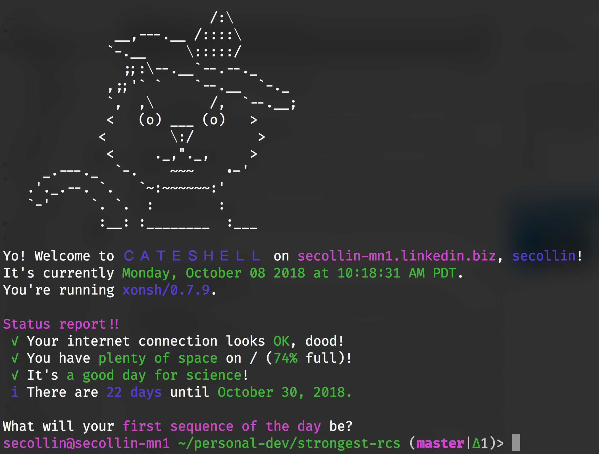

# ＣＡＴＥＳＨＥＬＬ 
The strongest shell-agnostic profile, myan!

Featurin' these nifty things:
 * Cross-shell support (tested: fish, bash, PowerShell, zsh)!
 * RCs for vim, screen, and tmux!
 * Git in-line status!
 * Auto-update functionality!
 * Nifty cat pictures!

Requires `python3` and `pip3`. If `python` points to `python3` and no `python3` binary exists, please symlink `python3` to `python` (same with `pip3`)!

# Installing on OSX/Linux
Run `install.sh`, then restart any open shells.

# Installing on Windows (PowerShell >= 3)
Run `.\install.ps1`, then restart any open shells.
